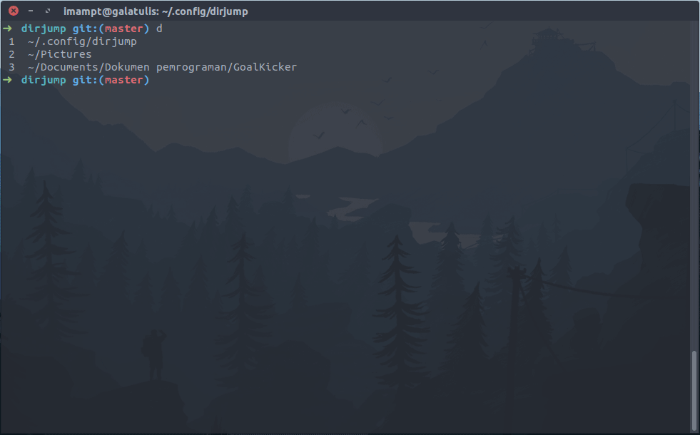

# dirjump

Easily jump to recently used directories with
[oh-my-zsh's 'd'](https://superuser.com/a/664139/943615)-like directory history
that still saved after exiting the terminal. A directory is considered to be used if you have opened a file or ran [your preferred command](#i-dont-use-vim) in that directory.

## Usage

### Main Feature

- Show the list of 10 most recent used directories with [`d`](#change-the-main-command).
 
- Jump to any directory in the list by [typing the number](#alternative-command-to-jump) of the directory in the list. You need to use 0 instead of 10 to jump to the 10th directory.

- A directory path will be put to the top of the list every time you use [`v`](#i-dont-use-vim)([vim](https://www.vim.org/about.php))  to edit files or `o`([xdg-open](https://linux.die.net/man/1/xdg-open)) to open a file from that directory. Or if you like, [every time you visit a directory](#always-put-visited-directory-to-the-history).

### Additional Feature

- Automatically list all files in the directory you jumped to if it contains 30 or fewer files. You can [disable this feature](#dont-list-files-after-jump) if you like.
- Home or `~/` is never added to the history (we can just type `cd`).
        
### Dirjump in action



## Personal Preference

You can modify the code to suit your needs. If you follow the [installation guide](#installation), the script is located in `~/.config/dirjump/dirjump`.

### Change the main command

You can change the main command from `d` to another by modifying [the code](https://github.com/imambungo/dirjump/blob/master/dirjump#L3) below:

```bash
dirjump_command="d"
```

### Alternative command to jump

By default, you can also jump with `<main command> <directory number>`:
```
d 8
```
If you already used any number as aliases, just delete or comment out the code from [line 18 to 25](https://github.com/imambungo/dirjump/blob/master/dirjump#L13).

### I don't use Vim

You can make a spesific command trigger dirjump to put your current directory to the directory history by adding the following line to the end of the script:

```
alias <yourcommand alias>="propose_dir_path && <yourcommand> " # make sure you put a space before the closing double quote
```

Here's an example to make `vsc` an alias of `code`([the command to run VSCode](https://askubuntu.com/a/852086/356625)):

```bash
alias vsc="propose_dir_path && code "
```

### Always put visited directory to the history

This is not recommended but if you want dirjump to always put visited directory to the history, add the following snippet to the end of the script:

```bash

# If using Zsh
if [ -n "$ZSH_VERSION" ]
then
	# Source: https://stackoverflow.com/a/3964198/9157799
	chpwd_functions=(${chpwd_functions[@]} propose_dir_path)
else
	cd()
	{
		builtin cd "$@" # https://unix.stackexchange.com/a/366974/307359
		propose_dir_path
	}
fi
```

### Don't list files after jump

[Here](https://github.com/imambungo/dirjump/blob/master/dirjump#L103), just delete it.

### Um... only 10??

[There](https://github.com/imambungo/dirjump/blob/master/dirjump#L8) you go.

## Installation

1. Download the script.

        curl --create-dirs -o ~/.config/dirjump/dirjump https://raw.githubusercontent.com/imambungo/dirjump/master/dirjump

2. Source the script to your shell. Don't forget to restart your terminal afterward.

        echo 'source ~/.config/dirjump/dirjump' >> ~/.bashrc

   If you use Zsh:

        echo 'source ~/.config/dirjump/dirjump' >> ~/.zshrc

## Uninstallation

1. Delete the script and the directory history file.

        rm -rf ~/.config/dirjump

2. [Unsource](https://stackoverflow.com/a/5413132/9157799) the script from your shell.

        grep -Fxv "source ~/.config/dirjump/dirjump" ~/.bashrc > temp; mv temp ~/.bashrc

   If you use Zsh:
   
        grep -Fxv "source ~/.config/dirjump/dirjump" ~/.zshrc > temp; mv temp ~/.zshrc
                                                        #####

## Contributing

If you found bugs, typos, wrong grammar, or have any suggestion or question,
feel free to create a new [issue](https://github.com/imambungo/dirjump/issues).
